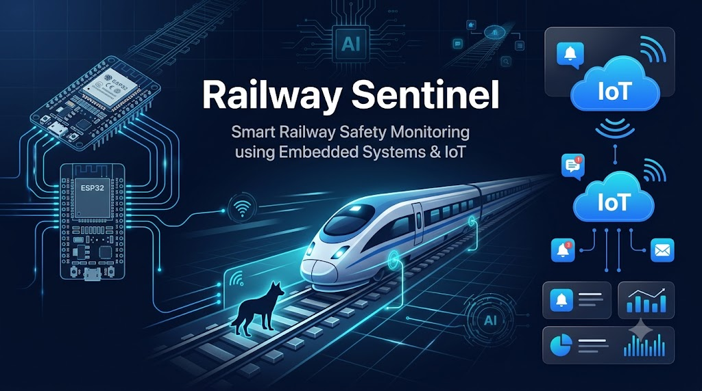
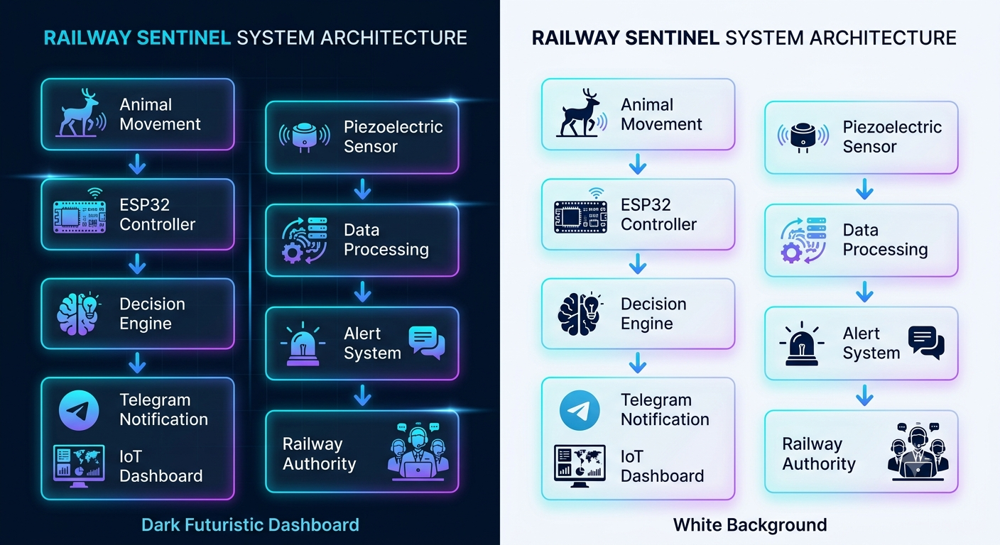
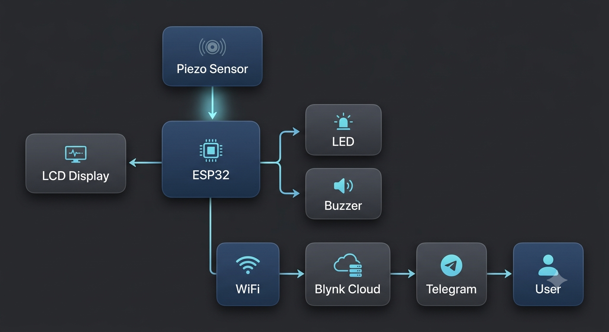
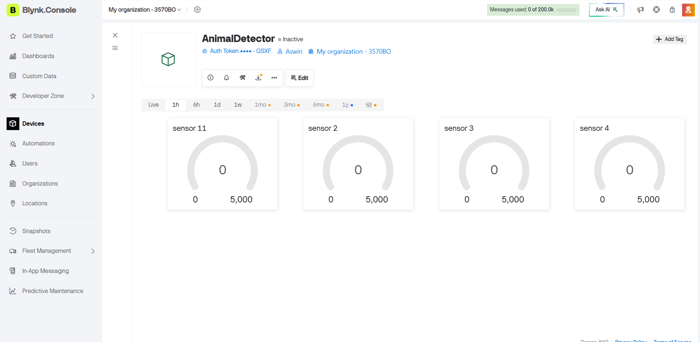
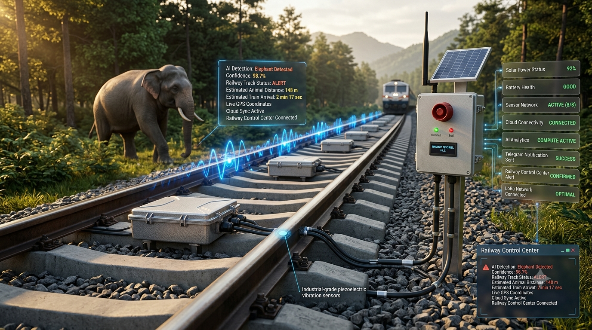

<p align="center">
  
</p>

<h1 align="center">🚆 Railway Sentinel</h1>

<h3 align="center">
Smart Railway Safety Monitoring using Embedded Systems & IoT
</h3>

<p align="center">


</p>

<p align="center">


</p>

---

# 📖 Overview

Railway Sentinel is an intelligent **Embedded Systems & IoT** solution designed to improve railway safety through continuous track monitoring.

Using a **Piezoelectric Sensor**, the system detects abnormal vibrations generated on railway tracks. The collected data is processed by an **ESP32 microcontroller**, which instantly activates local warning devices and sends live notifications to the **Blynk IoT Dashboard**, enabling faster decision-making and improving operational safety.

---

# ✨ Key Features

- 🚆 Real-Time Railway Track Monitoring
- ⚡ Piezoelectric Vibration Detection
- 📡 ESP32 Wi-Fi Connectivity
- 📱 IoT Cloud Dashboard
- 🚨 Instant Alert System
- 🔴 Red LED Warning
- 🟢 Green LED Safe Status
- 🔊 Buzzer Notification
- 📟 LCD Live Status
- 💰 Cost-Effective Embedded Design
- 🔋 Low Power Consumption
- 📈 Scalable for Future Railway Deployment

---

# 🛠 Tech Stack

<p align="center">


</p>

---

# 🏗 System Architecture

<p align="center">



</p>

The architecture demonstrates communication between the sensing unit, ESP32 controller, cloud dashboard, and local alert devices.

---

# 📊 Block Diagram

<p align="center">



</p>

The block diagram represents the complete data flow from railway vibration sensing to cloud monitoring.

---

# 📱 IoT Dashboard

<p align="center">



</p>

### Dashboard Features

- Live Sensor Values
- Device Status
- Instant Notifications
- Cloud Connectivity
- Remote Monitoring

---

# 🚆 Future Deployment Concept

<p align="center">



</p>

This concept demonstrates how Railway Sentinel could be integrated into real railway infrastructure using distributed smart sensor nodes, cloud communication, and centralized monitoring.

---

# ⚙ System Workflow

```text
Railway Track
      │
      ▼
Piezoelectric Sensor
      │
      ▼
Signal Conditioning
      │
      ▼
ESP32 Controller
      │
 ┌───────────────┬────────────────┐
 │               │                │
 ▼               ▼                ▼
LCD          LED Indicator     Buzzer
 │
 ▼
Blynk Cloud
 │
 ▼
Mobile Dashboard
```

---

# 🛠 Hardware Components

| Component | Purpose |
|------------|----------------------------|
| ESP32 | Main Controller |
| Piezoelectric Sensor | Track Vibration Detection |
| LCD Display | System Status |
| Red LED | Alert Indicator |
| Green LED | Safe Indicator |
| Buzzer | Audible Warning |
| Breadboard | Prototype Circuit |
| Jumper Wires | Hardware Connections |

---

# 💻 Software Stack

| Software | Purpose |
|-----------|---------------------------|
| Arduino IDE | Firmware Development |
| Embedded C++ | Programming Language |
| Blynk IoT | Cloud Monitoring Platform |

---

# 📂 Repository Structure

```text
Rail_Sentinal/
│
├── Arduino_Code/
├── Docs/
│   ├── Algorithm.md
│   ├── Future_Enhancements.md
│   └── Rail sentinal.pptx
├── Images/
│   ├── Banner.png
│   ├── Block_Diagram.png
│   ├── System_Architecture.png
│   ├── blynk.png
│   └── Predicted_Output.png
├── Results/
├── README.md
├── LICENSE
├── .gitignore
└── requirements.txt
```

---

# 🚀 Future Enhancements

- 🤖 AI-Based Animal Detection
- 📷 Thermal Camera Integration
- 📍 GPS Tracking
- 📡 LoRa Communication
- ☁ Cloud Analytics
- 📱 Android Application
- 🔋 Solar Powered Sensor Nodes
- 🚄 Railway Control Center Integration

---

# 🌐 Connect

<p align="center">

<a href="mailto:abinayaravikani@gmail.com">

</a>

&nbsp;

<a href="https://linkedin.com/in/abinayaravi17">

</a>

&nbsp;

<a href="https://www.instagram.com/designsofabinaya">

</a>

</p>

---

# 📜 License

This project is licensed under the **MIT License**.

---

<p align="center">

### ⭐ If you found this project useful, consider giving it a Star!

**Built with ❤️ using Embedded Systems, ESP32, Arduino & IoT**

</p>
